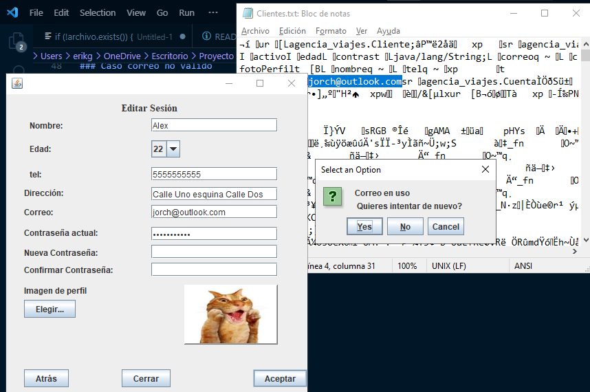
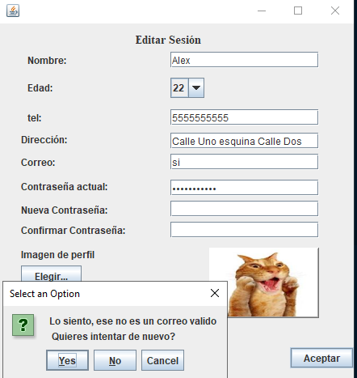

# Demostraciones
## Creación de cuenta(Administrador)
### Caso cuenta ya existente (Cliente)
 
### Caso cuenta ya existente (Admin)
 
### Caso correo no valido
 
### Caso contraseñas no coinciden
 
### Caso contraseña no valida 
 

## Creación de cuenta(Cliente)
### Caso cuenta ya existente (Cliente)
 

### Caso cuenta ya existente (Admin)
 

### Caso correo no valido
 

### Caso contraseñas no coinciden
 

### Caso contraseña no valida
 

### Creación de cuenta con imagen por default
 

## Inicio de sesión
### Datos no coincidentes
 

## Registro de Servicio
### Registrar servicio con imagen por default
 

## Edicion de cuenta(Admin)
### Caso cuenta ya existente

### Caso correo no valido

### Caso contraseñas no coinciden

### Caso contraseña no valida 

### Contraseña actual no coincide

## Edicion de cuenta (Cliente)
### Caso cuenta ya existente (Cliente)

### Caso cuenta ya existente (Admin)

### Caso correo no valido

### Contraseña actual no coincide

### Caso contraseñas no coinciden

### Caso contraseña no valida 

## Comprar servicio
### Dinero insuficiente
 
 

### Sin servicios disponibles
 

## Mostrar historial (Cliente)
### Sin historial
 

## Mostrar historial (Admin)
### Sin historial
 